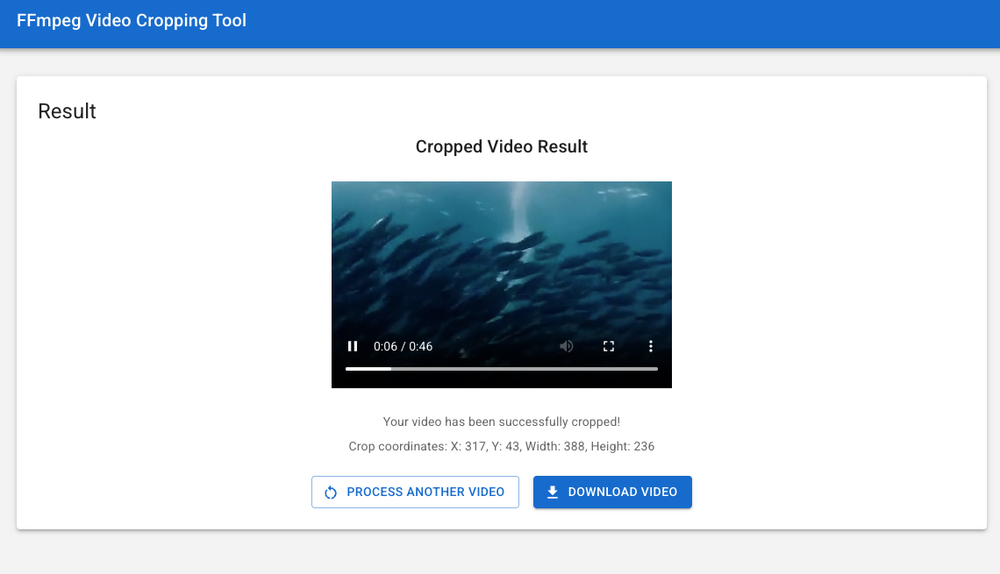

# FFmpeg Video Cropping Tool

## 预览




## 提示词

```prompt
需求：用ffmpeg裁切视频指定坐标。
实现逻辑：
- 1. 前后端分离
- 2. 前端用React技术栈，后端用FastAPI
- 3. 用户上传视频可以预览，并且可以用自定义选择框
- 4. 用鼠标拖拉可以选择指定要裁切的框，点击确定生成指定裁切后的视频
```

This application allows users to upload videos, preview them, select a specific region using a draggable selection box, and crop the video using FFmpeg.

## Features

- Upload and preview videos
- Interactive crop selection with draggable handles
- Server-side video cropping using FFmpeg
- Download cropped videos

## Tech Stack

- **Frontend**: React, Material-UI
- **Backend**: FastAPI (Python)
- **Video Processing**: FFmpeg

## Setup

### Prerequisites

- Python 3.8+ (for FastAPI backend)
- Node.js and npm (for React frontend)
- FFmpeg installed on the server

### Backend Setup

1. Navigate to the server directory:

   ```
   cd server
   ```

2. Create a virtual environment:

   ```
   python -m venv venv
   source venv/bin/activate  # On Windows: venv\Scripts\activate
   ```

3. Install dependencies:

   ```
   pip install -r requirements.txt
   ```

4. Run the server:
   ```
   python run.py
   ```

The server will start at http://localhost:8000

### Frontend Setup

1. Navigate to the client directory:

   ```
   cd client
   ```

2. Install dependencies:

   ```
   npm install
   ```

3. Start the development server:
   ```
   npm start
   ```

The frontend will be available at http://localhost:3000

## Usage

1. Upload a video file by dragging and dropping or using the file browser
2. Once the video is uploaded, it will be displayed with a crop selection box
3. Drag the box to move it, or drag the handles to resize it
4. Click "Crop Video" to process the video
5. The cropped video will be displayed for preview
6. Download the cropped video or process another one

## Project Structure

- **client/**: React frontend application
- **server/**: FastAPI backend application
  - **app/**: Main application directory
    - **routers/**: API routes
    - **static/**: Uploaded and processed videos
  - **requirements.txt**: Python dependencies
